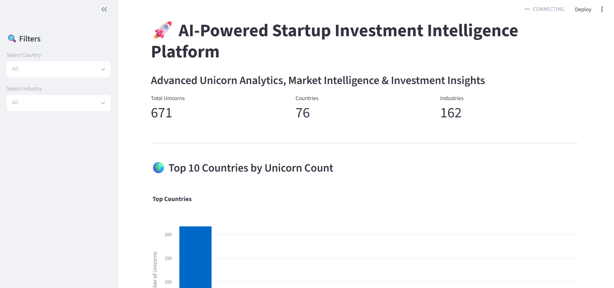

# 🚀 AI-Powered Startup Investment Intelligence Platform

## 📌 Project Overview

The AI-Powered Startup Investment Intelligence Platform is a data analytics project designed to analyze global unicorn companies and uncover valuable startup ecosystem insights.

The project leverages Exploratory Data Analysis (EDA), data visualization, and an interactive Streamlit dashboard to identify country-wise unicorn distribution, industry dominance, market trends, and investment intelligence patterns.

---

## 🎯 Project Objectives

- Analyze global unicorn company data.
- Identify startup ecosystem trends and patterns.
- Discover leading countries and industries.
- Detect data quality issues and missing values.
- Build an interactive dashboard for business intelligence.
- Generate actionable investment insights.

---

## 📂 Dataset Information

| Metric | Value |
|----------|----------|
| Dataset Name | Unicorn Companies Dataset |
| Total Records | 671 |
| Total Countries | 76 |
| Total Industries | 162 |
| Data Type | Startup & Unicorn Analytics |

---

## 🔍 Exploratory Data Analysis (EDA)

### Data Quality Analysis

- Missing Value Detection
- Duplicate Record Analysis
- Data Cleaning & Preprocessing
- Data Type Validation

### Trend Analysis

- Country-wise Unicorn Distribution
- Industry-wise Unicorn Distribution
- Unicorn Ecosystem Analysis
- Startup Market Intelligence

### Statistical Analysis

- Descriptive Statistics
- Distribution Analysis
- Data Quality Assessment

### Visualizations

- Bar Charts
- Pie Charts
- KPI Cards
- Interactive Dashboard
- Business Intelligence Insights

---

## 📊 Dashboard Preview

Interactive Streamlit dashboard featuring unicorn company analytics, country-wise distribution, industry insights, KPI cards, and investment intelligence visualization.



---

## 🚀 Dashboard Features

### KPI Metrics

- Total Unicorn Companies
- Total Countries
- Total Industries

### Interactive Filters

- Country Filter
- Industry Filter

### Analytics

- Top Countries by Unicorn Count
- Top Industries Analysis
- Industry Share Visualization
- Dataset Preview
- Missing Values Analysis

### User Interface

- Interactive Streamlit Dashboard
- Responsive Layout
- Business Intelligence Design

---

## 📈 Key Findings

### Country Insights

- United States leads the global unicorn ecosystem.
- China and India are among the strongest startup ecosystems.

### Industry Insights

- Financial Technology (FinTech) is the dominant unicorn sector.
- Software and Artificial Intelligence industries show significant growth.

### Data Quality Insights

- Founder information contains substantial missing values.
- Industry data contains minor missing records.

### Market Insights

- Unicorn companies are concentrated in a limited number of countries.
- Technology-driven sectors dominate the startup landscape.

---

## 🛠️ Technologies Used

### Programming

- Python

### Data Analysis

- Pandas
- NumPy

### Data Visualization

- Matplotlib
- Seaborn
- Plotly

### Dashboard Development

- Streamlit

### Development Environment

- Jupyter Notebook
- Visual Studio Code
- Git & GitHub

---

## 📁 Project Structure

```text
AI-Powered-Startup-Investment-Intelligence-Platform
│
├── assets
│   └── dashboard.png
│
├── dashboard
│   └── app.py
│
├── data
│   └── unicorn_companies.csv
│
├── notebooks
│   └── EDA.ipynb
│
├── reports
│   └── EDA_Report.pdf
│
├── README.md
│
└── requirements.txt
```
---

## 👨‍💻 Author

**Deepak Adhikari**
